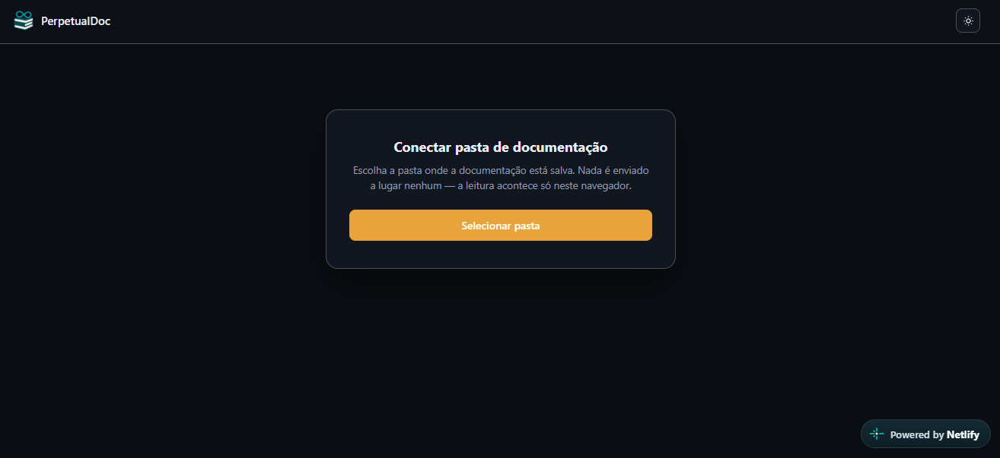

# PerpetualDoc Web

Interface web para consultar, num só lugar, várias documentações geradas pelo [PasDoc](https://pasdoc.github.io/) (Object Pascal / Delphi) — com busca instantânea por classe, unit ou conteúdo, apresentando cada documentação exatamente como ela é gerada.

**Site:** https://perpetualdoc.netlify.app
**Código-fonte:** https://github.com/NdeFaria/PerpetualDocWeb

## Este documento é sobre segurança

Se você usa este site pra consultar documentação da empresa, a pergunta natural é: *"isso vaza alguma coisa pra internet?"* Este README existe pra responder essa pergunta com clareza, e pra que qualquer pessoa possa conferir sozinha, olhando o código-fonte, que é verdade.

**Resposta curta: não. Nada do conteúdo da sua documentação sai do seu computador, em nenhum momento.**

## Como o site lida com os seus dados

1. **Você escolhe uma pasta, e só o seu navegador sabe qual é.** Ao clicar em "Selecionar pasta", o próprio Chrome/Edge abre o seletor de pastas do sistema operacional (é um recurso nativo do navegador, chamado File System Access API). O site nunca fica sabendo o caminho real da pasta no seu disco — só recebe autorização pra ler o conteúdo dos arquivos que você escolheu.
2. **Essa autorização fica guardada só no seu navegador**, num espaço de armazenamento local (IndexedDB) que existe apenas na sua máquina. Ela não é enviada, sincronizada nem replicada em lugar nenhum.
3. **A leitura e a busca acontecem dentro do seu navegador.** Quando você abre uma documentação ou digita algo na busca, é o JavaScript rodando na sua própria aba que lê os arquivos do disco e monta o resultado na tela. Não existe um servidor recebendo essas informações, processando-as ou guardando-as.
4. **Um Service Worker — também um recurso nativo do navegador, sem nenhum servidor por trás — entrega os arquivos da documentação pra tela exatamente como estão no disco.** Ele intercepta os pedidos (HTML, CSS, imagens) e responde lendo o arquivo local, como se fosse um servidor, mas rodando inteiramente dentro do seu navegador.

Em resumo: o conteúdo da documentação nunca vira um pacote de rede. Ele não tem pra onde ir, porque a aplicação inteira roda no seu navegador.

## E o Netlify, onde isso está hospedado?

O Netlify hospeda só o **código do site** — três arquivos estáticos (`index.html`, `sw.js`, `favicon.ico`), sem nenhum servidor de aplicação, banco de dados ou API por trás. É o mesmo papel que o Netlify teria hospedando uma página HTML qualquer: ele entrega esses arquivos pro seu navegador quando você acessa o link, e a partir daí o que acontece é só entre você e o seu próprio computador, como descrito acima. O Netlify **nunca recebe, processa ou armazena** nenhum arquivo da sua documentação — ele não tem como, já que essa leitura nunca sai do seu navegador.

O repositório no GitHub está conectado direto ao Netlify: toda alteração enviada pro repositório é automaticamente publicada no site. Isso significa que o que está rodando em produção é sempre exatamente o que está no repositório público — dá pra comparar os dois e confirmar que não tem nada escondido.

## Tela de abertura



Selecione a pasta raiz onde ficam os projetos de documentação (a pasta que contém uma subpasta por projeto, cada uma com seu `index.html` gerado pelo PasDoc). A varredura acontece localmente; nada é enviado.

Da próxima vez que abrir o site no mesmo navegador, ele lembra da pasta — só pede uma confirmação de um clique.

## Como usar

1. Selecione a pasta de documentação (só na primeira vez).
2. Digite na busca do topo pra encontrar um projeto por nome, unit, classe ou conteúdo.
3. Abra um resultado — a documentação aparece exatamente como o PasDoc gerou.
4. Use **Buscar nesta página** pra procurar um termo dentro da documentação aberta.
5. O ícone de sol/lua alterna entre o visual original (claro) e um tema escuro aplicado por cima (opcional).
6. Se a pasta de documentação for atualizada (nova branch, novos fontes), use o botão de reescanear ao lado de "Trocar pasta".
7. Use **Editor TXT** (no topo) para escrever complementos de documentação em `.txt` com tags do PasDoc — veja abaixo.

## Editor TXT (complementos via @include)

O botão **Editor TXT** abre um editor de texto com botões que inserem as tags do PasDoc (`@bold`, `@italic`, `@code`, `@section`, `@link`, `@url`, listas, `@table`, `@longCode`, `@image`, `@param`, `@returns`…) e uma pré-visualização ao lado. O arquivo gerado é um `.txt` puro, pronto para ser referenciado no comentário de uma unit ou classe:

```pascal
{ @include(MinhaUnit.txt) }
```

- **Salvar** sobrescreve o arquivo aberto sem perguntar o local; se for um arquivo novo, pergunta onde gravar. **Salvar como…** sempre pergunta.
- **Abrir…** (ou arrastar um `.txt` para o editor) carrega um arquivo existente para edição.
- **Copiar @include** copia a linha `{ @include(<caminho completo>) }`. O navegador não revela caminhos do disco, então na primeira vez ele pergunta onde fica a pasta de documentação conectada (ou a pasta do arquivo, se ele estiver fora dela) e completa o resto sozinho. Se o arquivo ainda não foi salvo, ele oferece salvar na hora e já copia a linha.
- Na pré-visualização, clicar num `@link` abre a página correspondente da documentação em outra aba; âncoras aparecem marcadas (na documentação final elas são invisíveis) e imagens encontradas na pasta conectada são exibidas.
- A codificação é detectada ao abrir (ANSI/Windows-1252 ou UTF-8) e mantida ao salvar; para arquivos novos, o padrão é ANSI com quebra de linha CRLF, igual aos fontes Delphi. Dá para trocar na barra inferior.
- O PasDoc não tem tag de cor: o botão de cor usa `@html(<span style="color:…">)`, que funciona na saída HTML.
- Com a pasta de documentação conectada, a pré-visualização usa o `pasdoc.css` real e o `@link` sugere e confere nomes existentes.
- Os avisos na barra inferior apontam parênteses sem fechar, tags desconhecidas (ex.: um `@` de e-mail — use `@@`) e tabelas com número de células diferente.

Assim como o resto do site, o editor não envia nada para a internet: ele só lê e grava os arquivos que você escolher, e o rascunho fica no armazenamento local do navegador.

## Requisitos

Funciona em **Google Chrome, Microsoft Edge** ou outro navegador baseado em Chromium — são os únicos que têm o recurso de acesso a pastas locais que o site usa. Não funciona no Firefox nem no Safari.

## Quer rodar por conta própria?

Os três arquivos (`index.html`, `sw.js`, `favicon.ico`) também funcionam localmente, servidos por qualquer servidor simples (não abre com duplo clique, porque o Service Worker exige http/https):

```bash
python3 -m http.server 8080
```

## Limitações conhecidas

- Só funciona em navegadores Chromium.
- Não existe login com usuário/senha — cada pessoa conecta a própria pasta no próprio navegador. Isso é proposital: é justamente o que permite o site nunca ter acesso aos dados reais pela internet.
